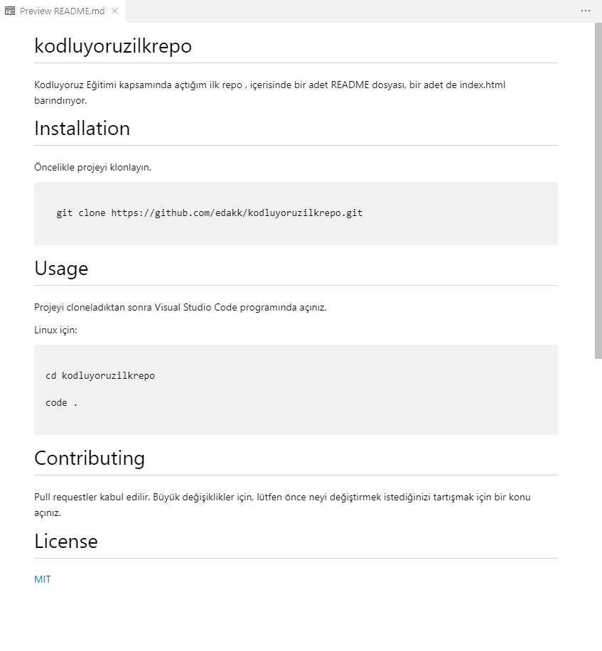

# kodluyoruzilkrepo
Kodluyoruz Eğitimi kapsamında açtığım ilk repo
, içerisinde bir adet README dosyası, bir adet de index.html barındırıyor.

 ""
 

# Installation
Öncelikle projeyi klonlayın.

```

  git clone https://github.com/edakk/kodluyoruzilkrepo.git

```

# Usage

Projeyi cloneladıktan sonra Visual Studio Code programında açınız.

Linux için:

```

cd kodluyoruzilkrepo 

code .

```
# Contributing

Pull requestler kabul edilir. Büyük değişiklikler için, lütfen önce neyi değiştirmek istediğinizi tartışmak için bir konu açınız.

# License

[MIT](https://choosealicense.com/licenses/mit/)

